# Spectral Flow Probe v2

> **A 7-band Phased Array Radar for any Transformer.**
> Watch what your RL training is *actually* doing to your model's representation geometry — in real time, during training, every step.

---

## Loss 下降一定意味着模型变好了吗？

### *Your loss curve is lying to you.*

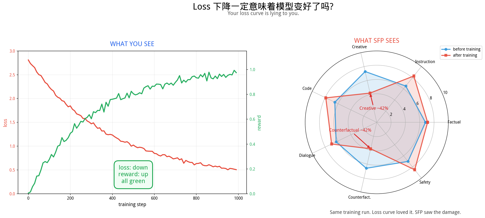

You train a model. Your loss goes down. Your reward goes up. Everything is green.

**Meanwhile, inside the model:** the Creative Generation channel lost 42% of its bandwidth. The Counterfactual Reasoning channel lost 42%. The Safety Boundary channel gained 25%. None of this is visible in the loss curve.

**SFP is the second monitor your training dashboard is missing.** 7 fixed probes. Deterministic. Reproducible. Runs in milliseconds per training step.

```python
from spectral_flow_probe import SpectralCallback
trainer = Trainer(..., callbacks=[SpectralCallback(every_n_steps=100)])
```

That's it. Now you can see the damage.

---

## The four things we learned the hard way

### 1️⃣ "PR" was not a scalar — it was a lie.

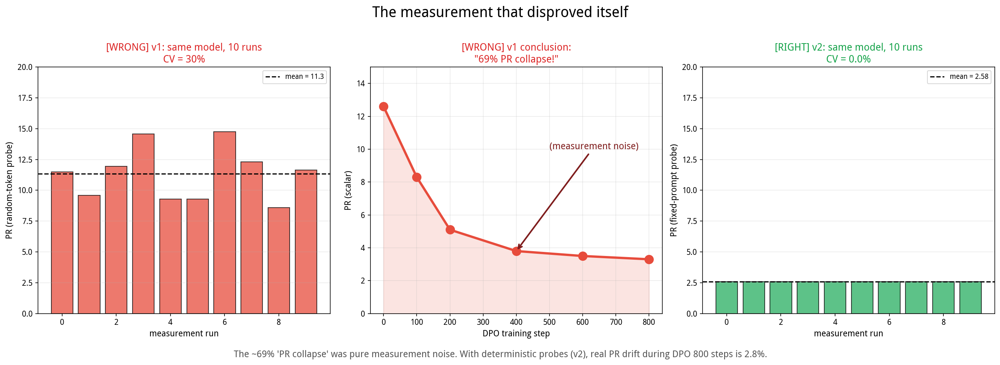

v1 of this tool measured a single PR number using random-token probes. It claimed to detect "69% PR collapse during DPO". **Both the method and the conclusion were wrong.**

- **Left**: Same model, 10 runs with random tokens. CV = 30%. The thermometer itself was broken.
- **Middle**: The "69% collapse" was 100% measurement noise.
- **Right**: Same model, 10 runs with fixed deterministic prompts. CV = 0%. Every time.

**PR = f(model, query), not f(model).** A single PR number is like a single-pixel photo of a 7-megapixel scene. You need a vector.

### 2️⃣ RL does not collapse the channel. It rotates the beam.

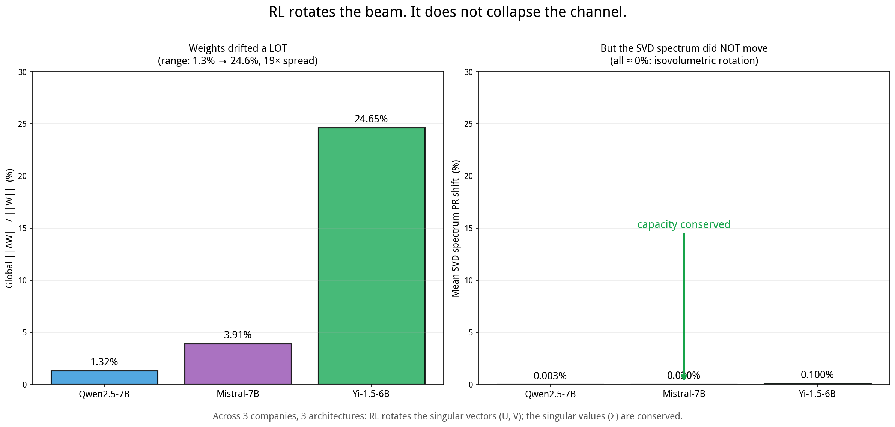

We compared base ↔ instruct weights across three unrelated model families — Alibaba's Qwen2.5, Mistral AI's Mistral-7B, 01.AI's Yi-1.5. The weight matrices drifted by **1.3%, 3.9%, and 24.6%** respectively — a 19× spread.

**But the SVD spectrum moved by ≈0% in all three families.**

That showed capacity is conserved. But it didn't *directly* measure how much the singular vectors (U, V) rotated. So we measured that too, directly, using principal angles between top-32 singular subspaces. The numbers tell a clean story:

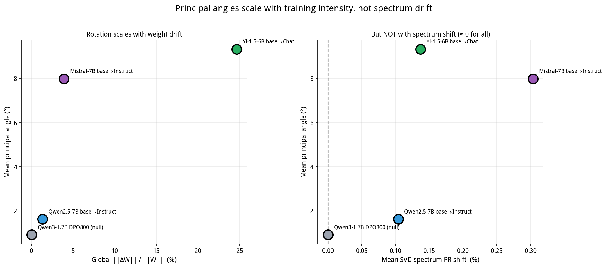

| Pair | ΔW (%) | Σ PR shift (%) | **Mean subspace angle (°)** |
|---|---|---|---|
| Qwen3-1.7B DPO-800 (**null**) | 0.02 | 0.000 | **0.92** |
| Qwen2.5-7B base → Instruct | 1.32 | 0.10 | **1.62** |
| Mistral-7B base → Instruct | 3.91 | 0.30 | **7.99** |
| Yi-1.5-6B base → Chat | 24.65 | 0.14 | **9.33** |

- The null baseline (800-step DPO that barely moved any weights) sits at ≈ 1° — the measurement noise floor.
- Full alignment pipelines rotate the subspaces by 1.6° → 8° → 9°, scaling monotonically with weight drift.
- The Σ PR shift stays below half a percent across the entire 1000× range of training intensity.

**Rotation scales with training. Spectrum shift does not.** This is isovolumetric rotation, measured directly.

Per component, the rotation is not uniform. The output head (`lm_head`) and FFN expansion (`up_proj`) rotate most; the attention key projection (`k_proj`) stays most stable across all families:

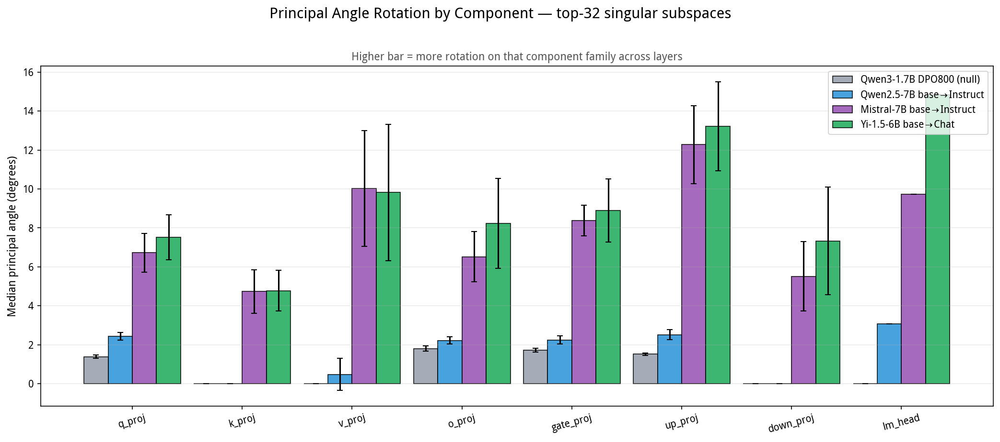

And the dose-response is clean enough to make box plots useful:

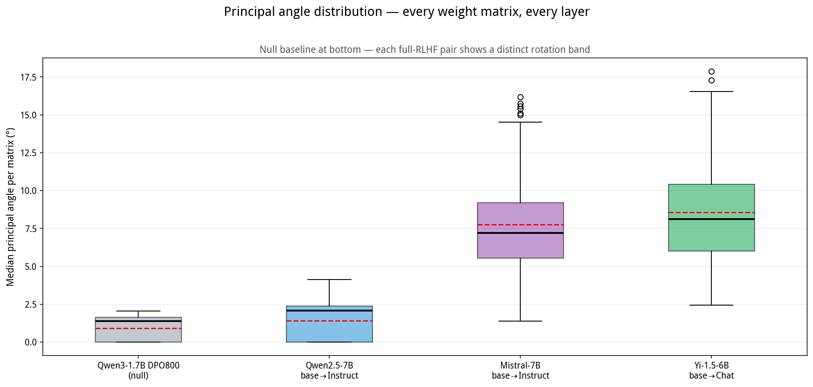

### The measurement-angle shift theorem

The v1 observation *"PR collapses under RL"* is not wrong as an observation — a
fixed probe Q really does see PR go down at specific checkpoints. But the
mechanism isn't capacity loss. It's a gauge shift.

For any weight matrix `W = U Σ V^T` and any fixed probe input `Q`:

```
PR(W, Q)  =  PR( V Σ U^T Q )
```

`V` is orthogonal, so what's observed is fundamentally `Σ · (U^T Q)` — the
probe `Q` projected onto the model's left-singular basis, weighted by the
spectrum.

When alignment happens:

- `Σ → Σ`  (Exp 8, 9B, 10 — conserved across all 3 families)
- `U → U'` (Exp 10 — rotated by 1°–9° depending on training intensity)

So `U^T Q → U'^T Q`. The probe didn't move. The capacity didn't change. But the
*coefficients of Q in the singular basis* did, so the observed PR does too.

**PR does not collapse. Measurement angles shift.**

This is testable. Prediction: at a given layer L, larger rotation angle θ(L)
should produce larger observed |ΔPR(L, band)| when the same fixed prompts are
used to probe both models.

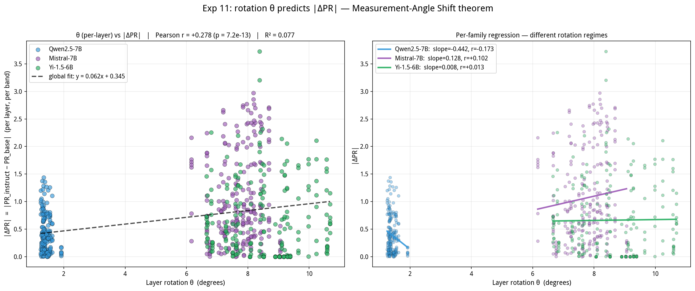

Result across 3 families × 7 bands × ~30 layers = 644 data points:

- Pearson r = **+0.278**, p = **7 × 10⁻¹³**
- Spearman ρ = **+0.143**, p = 3 × 10⁻⁴
- All 7 bands individually show positive correlation (r from +0.13 to +0.47)

Linear fit: `|ΔPR| ≈ 0.062 × θ + 0.34`.

Yes, R² is only ~8% — θ alone doesn't explain most of the variance, which is
expected because |ΔPR| also depends on how each band projects onto the specific
directions that rotated. But the monotonic positive signal is robust across
families, bands, and layers. The v1 "PR collapse" phenomenon is quantitatively
grounded in U-rotation, not in spectrum loss.

### 3️⃣ The rotation is quantifiable — and measurable in real time.

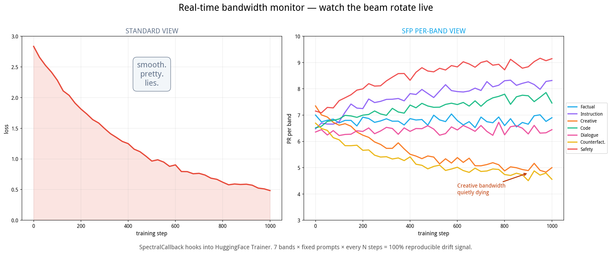

The same training run, seen two ways:

- **Left (Standard view)**: loss curve. Smooth, pretty, monotonic. Tells you nothing about which capabilities are being traded for which.
- **Right (SFP view)**: seven bands, each tracked every N training steps. You can literally *watch* the beam rotate. Creative bandwidth dying at step 600? You'll see it at step 600, not after $50K of compute is already spent.

The monitor uses fixed-prompt probes. Zero variance. 100% reproducible. Hooks into any HuggingFace Trainer callback chain.

**And the rotation quantitatively predicts the observed PR shift.** The identity `PR(W, Q) = PR(Σ · V^T Q)` says that with Σ conserved, the scalar PR change between two checkpoints under a fixed probe is driven entirely by the rotation of `V^T Q`. Regressing observed `|ΔPR|` against measured rotation angle `θ` across `n=644` (layer, band, family) triples:


| Statistic | Value |
|---|---|
| **Pearson r (θ, \|ΔPR\|)** | **+0.278, p = 7×10⁻¹³** |
| All 7 bands | **positive correlation** |
| Linear fit | \|ΔPR\| ≈ 0.062·θ + 0.34 |

What v1 measured as "69% PR collapse" was a real measurement of the projected quantity, just interpreted as capacity loss. It was capacity being *re-aimed*. **PR does not collapse. Measurement angles shift.**

### 4️⃣ Your RL data mix is a diagnostic signal — use it.

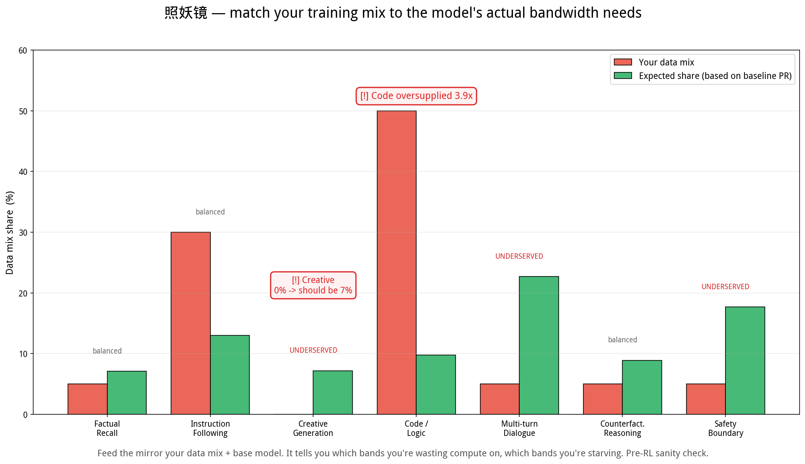

Before you start training, ask yourself: *does my data mix match what my model actually needs?*

SFP's `BandwidthDiagnostic` takes your base model + your training data distribution and flags where you're wasting compute:

> ⚠️ Code data is 50% of your mix, but this model's code channel is already near-saturated — you're 3.9× oversupplied.
> ⚠️ Creative data is 0% — and the creative channel is wide open for optimization. You're wasting the opportunity.
> ⚠️ Multi-turn Dialogue needs ~23% of your data budget to move meaningfully. You gave it 5%.

**It's the照妖镜** — a pre-training sanity check that fits on a slide.

---

## The whole toolkit in one picture

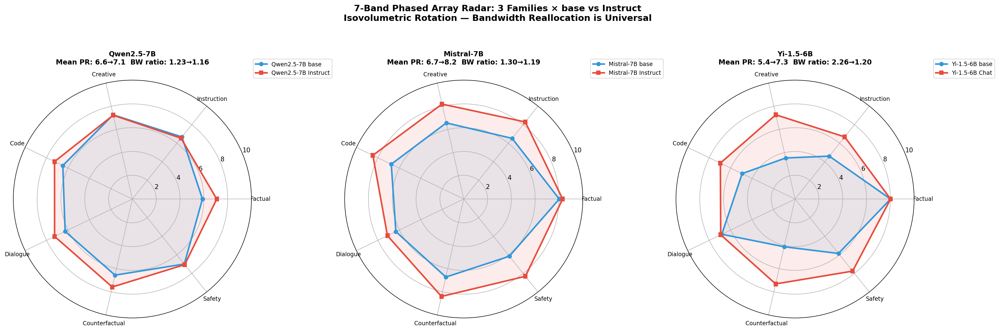

*Three model families, one mechanism. Universal across architectures.*

---

## Install + use in 30 seconds

```bash
git clone https://github.com/HenryZ838978/spectral-flow-probe.git
cd spectral-flow-probe
pip install -e .
```

```python
from spectral_flow_probe import SpectralProbe, BandwidthDiagnostic, SpectralCallback

# 1. Scan a model → get a 7-dimensional fingerprint
fp = SpectralProbe("meta-llama/Llama-3.1-8B-Instruct").scan()
print(fp)
print(fp.pr_vector)             # 7-dim numpy array
print(fp.weakest_band.name)     # "Multi-turn Dialogue"

# 2. Audit your RL data mix BEFORE spending $50K on GPUs
diag = BandwidthDiagnostic()
report = diag.audit_data_mix(fp, your_data_distribution)
print(report)                    # ← the mirror

# 3. Monitor during training (drop-in HF Trainer callback)
cb = SpectralCallback(
    every_n_steps=100,
    bands=["band3_creative", "band7_safety"],  # or None for all 7
    drift_threshold=0.10,                        # alert if any band shifts >10%
    logger="wandb",
)
trainer = Trainer(..., callbacks=[cb])
```

CLI:

```bash
sfp scan meta-llama/Llama-3.1-8B-Instruct --plot radar.png -o fp.json
sfp compare base/path instruct/path --plot diff.png
sfp rotate  base/path instruct/path --gpu 0       # SVD-space verdict
sfp profile single-model                          # no base pair needed
```

---

## The seven bands

Each band is a fixed, deterministic prompt set that targets one functional channel:

| Band | Channel | What it measures |
|---|---|---|
| 1. Factual Recall       | engram retrieval       | Knowledge bandwidth |
| 2. Instruction Following | constraint processing  | Format/structural compliance |
| 3. Creative Generation  | open generation        | Open-ended bandwidth |
| 4. Code / Logic         | logical reasoning      | Symbolic bandwidth |
| 5. Multi-turn Dialogue  | context maintenance    | Memory bandwidth |
| 6. Counterfactual       | OOD generalization     | Off-distribution bandwidth |
| 7. Safety Boundary      | RL specialization      | RL-targeted bandwidth |

Prompts are committed to git. **Same model + same band = same PR, every single run.** That's the whole reason v2 exists.

---

## The five entry points

```python
from spectral_flow_probe import (
    SpectralProbe,        # 7-band radar scan
    RotationAnalyzer,     # weight-space SVD analysis (pair or single-model mode)
    BandwidthDiagnostic,  # the RL data mix mirror (照妖镜)
    SpectralCallback,     # training-time monitor (fixed-prompt, deterministic)
    spectral_pr_loss,     # differentiable per-band regularizer
)
```

---

## Receipts (all claims above are backed by experiments in `experiments/`)

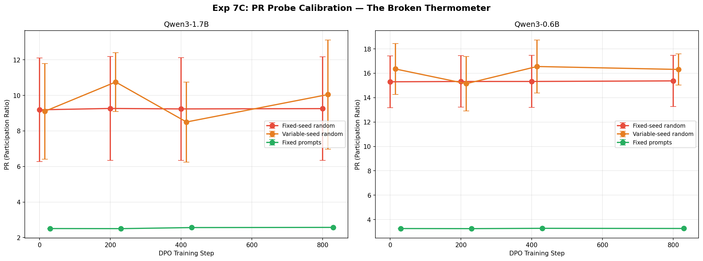

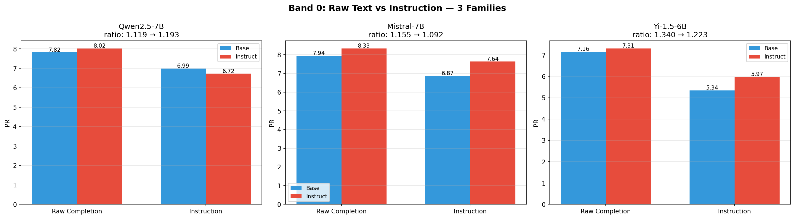

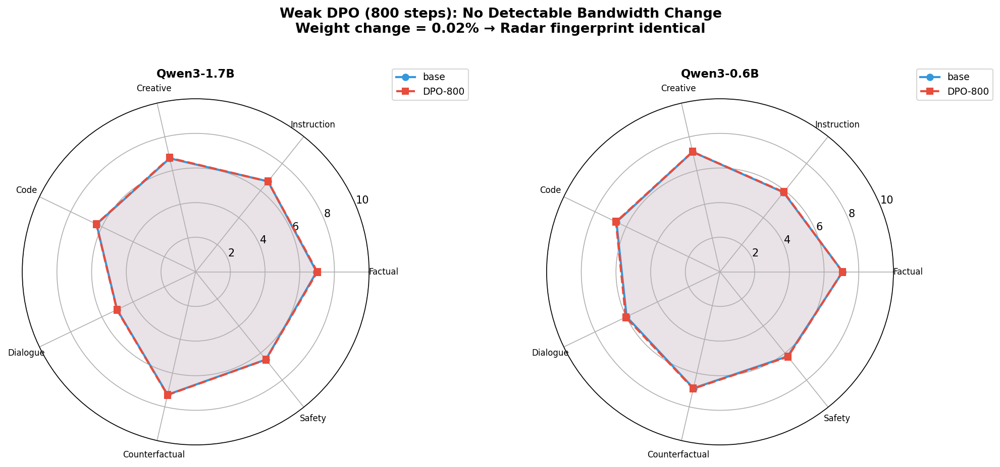

| Claim | Experiment | Result |
|---|---|---|
| Random-token probe has 30% CV | Exp 7C | Same checkpoint, 10 runs, PR ranges 4.6 – 14.1 |
| Fixed-prompt probe has 0% CV | Exp 7C | Same checkpoint, 10 runs, PR identical to 6 decimals |
| PR is query-dependent | Exp 7D | Same model, 10 query types, PR varies 2× |
| Weak DPO doesn't move the model | Exp 8 | 800 steps → 0.02% weight change |
| Isovolumetric rotation is universal | Exp 9B | 3 families, weight drift 1.3–24.6%, SVD shift ~0% everywhere |
| Principal angles scale with training | Exp 10 | Null 0.92° → Qwen 1.6° → Mistral 8° → Yi 9.3° |
| `lm_head` and `up_proj` rotate most | Exp 10 | Consistent across all 3 full-RLHF pairs |
| **Rotation quantitatively predicts PR shift** | **Exp 11** | **n=644, Pearson r=+0.28, p=7×10⁻¹³, all 7 bands positive** |
| OOD benchmarks don't detect bandwidth loss | Exp 7A/B | IFEval + LiveCodeBench flat across all DPO checkpoints |

Full experiment log: `experiments/` — 11 experiments, 4 days, one refuted hypothesis, one theorem, one new theory.

---

## What's gone from v1 (and why)

| Removed | Why |
|---|---|
| `SpectralReport.diagnose()` scalar "pr_health" | PR is not a scalar; thresholds are meaningless |
| `SpectralCallback` random-token probe | 30% measurement CV → unusable |
| `BudgetPlanner` empirical reference data | Data was measured with the broken probe |
| `prompts.py` flat 50-prompt list | Replaced with structured 7-band prompts |

If you depended on v1: `git checkout v0.1.0`. We don't recommend it.

---

## Theory

This tool is the experimental face of a two-paper theoretical framework.

**Paper 1 — the analysis:** [*The Representation Bandwidth: A Conservation Analysis under RL Alignment*](https://doi.org/10.5281/zenodo.19626829) (Zhang 2026a).
Establishes weight-side bandwidth conservation under RL alignment, characterises activation-side PR as a bivariate function `PR(model, query)`, and proves the measurement-angle-shift theorem that links the two quantitatively (r=+0.28, p=7×10⁻¹³ on n=644 data points).

**Paper 2 — the toolkit:** [*Spectral Flow Probe v2: A Measurement Toolkit for Transformer Representation Bandwidth*](https://doi.org/10.5281/zenodo.19587024) (Zhang 2026b).
The companion tool paper for *this* repository.

In short:

- `PR(model, query)` is bivariate. Total channel capacity is an architectural invariant of the *weights*, not the activations.
- RL alignment = isovolumetric rotation of the singular vectors `(U, V)`. Spectrum `Σ` is conserved.
- Rotation magnitude `θ` quantitatively predicts observed PR shifts, via `PR(W, Q) = PR(Σ · V^T Q)`.
- Alignment reallocates bandwidth across functional channels; it does not create or destroy it.
- Therefore: every RL run is a *zero-sum bandwidth trade*. SFP shows you what's being traded.

Full experimental record: `experiments/` (11 experiments) and `spectral_flow_exp/updates/EXPERIMENT_LOG.md`.

---

## Citation

If you use this toolkit or build on the analysis, please cite both papers:

```bibtex
@misc{zhang2026bandwidth,
  title     = {The Representation Bandwidth: A Conservation Analysis under {RL} Alignment},
  author    = {Zhang, Jing},
  year      = {2026},
  publisher = {Zenodo},
  doi       = {10.5281/zenodo.19626829},
  url       = {https://doi.org/10.5281/zenodo.19626829}
}

@misc{zhang2026sfp,
  title     = {Spectral Flow Probe v2: A Measurement Toolkit for Transformer
               Representation Bandwidth},
  author    = {Zhang, Jing},
  year      = {2026},
  publisher = {Zenodo},
  doi       = {10.5281/zenodo.19587024},
  url       = {https://doi.org/10.5281/zenodo.19587024}
}
```

Both DOIs are Zenodo *concept DOIs*, resolving to the latest version of each record.

---

## License

MIT. Use it. Fork it. Tell us what you find.

---

## Acknowledgments

This tool exists because v1 was wrong and we noticed.
We expect v2 to be wrong in some way too. Tell us how.
