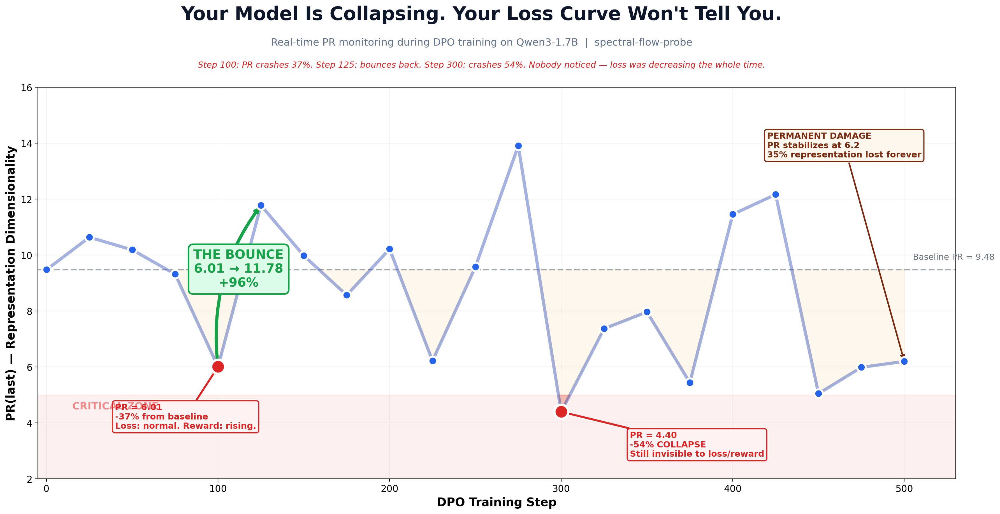
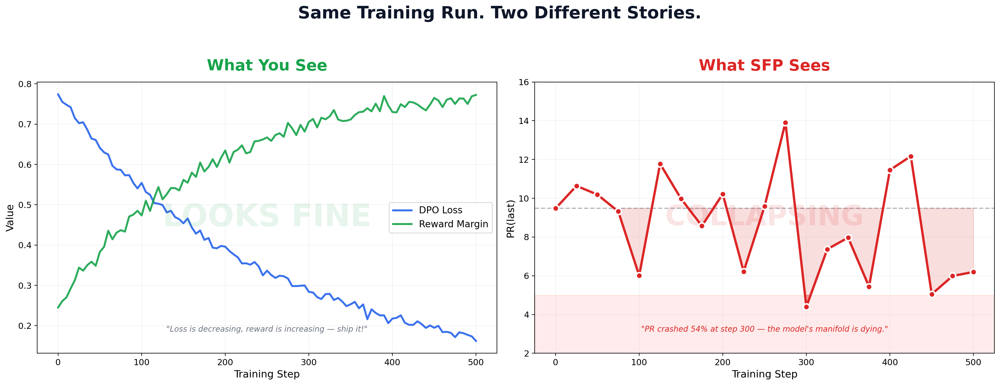
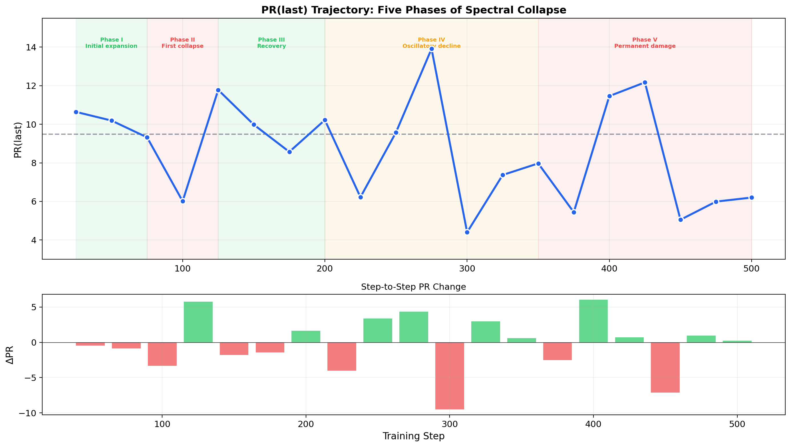
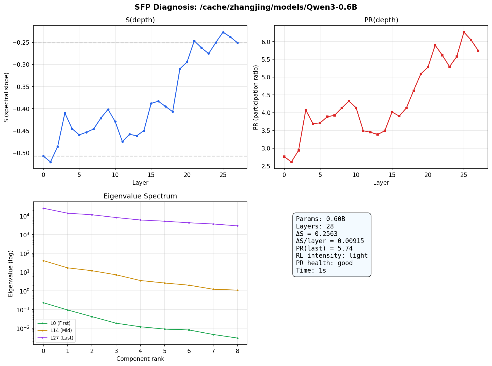
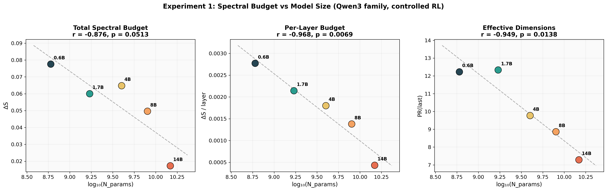
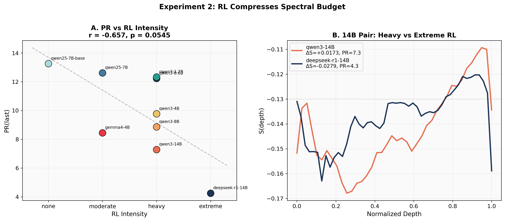
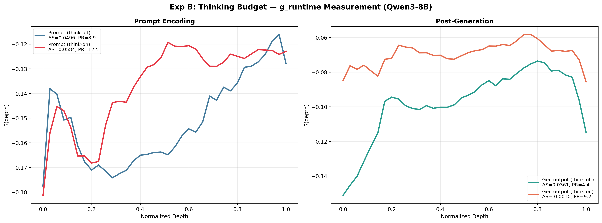
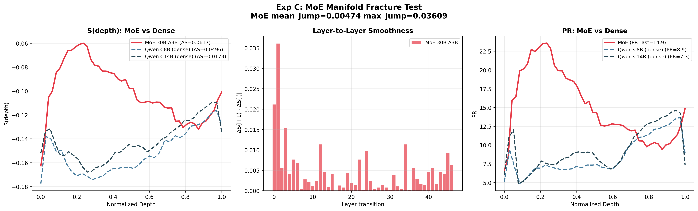
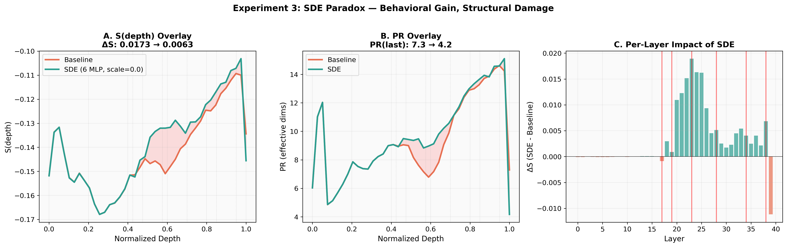
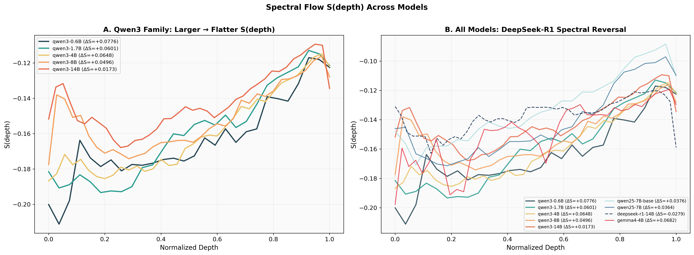

<div align="center">

<h1>

</h1>

<p>


</p>

</div>

---

<div align="center">



</div>

---

<div align="center">

<h2>Your model is collapsing during RL. Your loss curve won't tell you.</h2>

<table>
<tr>
<td width="60" align="center"><h1>37%</h1></td>
<td>PR crash at <b>step 100</b> — completely invisible to loss and reward curves</td>
</tr>
<tr>
<td width="60" align="center"><h1>54%</h1></td>
<td>Worst collapse at <b>step 300</b> — representation drops to PR = 4.40</td>
</tr>
<tr>
<td width="60" align="center"><h1>35%</h1></td>
<td><b>Permanent</b> representation capacity lost after 500 steps of standard DPO</td>
</tr>
<tr>
<td width="60" align="center"><h1>0</h1></td>
<td>Number of standard training metrics that detected any of this</td>
</tr>
</table>

<br/>

<i>Measured during DPO training on Qwen3-1.7B with LoRA. Every 25 steps, one PCA scan (< 2 seconds).<br/>Loss was decreasing. Reward was increasing. The manifold was dying.</i>

</div>

---

<div align="center">



<br/>
<sub>Left: what every RL practitioner monitors. Right: what's actually happening to the representation geometry. <b>Same training run.</b></sub>

</div>

---

## Why This Matters

<div align="center">
<table>
<tr>
<th width="33%">2012</th>
<th width="33%">2015</th>
<th width="33%">2026</th>
</tr>
<tr>
<td align="center">
<b>Gradient Explosion</b><br/>
<sub>Hidden failure mode</sub><br/><br/>
<code>grad_norm</code> → Gradient Clipping<br/>→ LayerNorm
</td>
<td align="center">
<b>Activation Drift</b><br/>
<sub>Hidden failure mode</sub><br/><br/>
<code>activation_stats</code> → BatchNorm<br/>→ RMSNorm
</td>
<td align="center">
<b>PR Collapse</b><br/>
<sub>Hidden failure mode</sub><br/><br/>
<code>PR(last)</code> → SpectralCallback<br/>→ <b>spectral_pr_loss</b>
</td>
</tr>
<tr>
<td align="center"><sub>Without it, deep networks were impossible</sub></td>
<td align="center"><sub>Without it, training was 10x slower</sub></td>
<td align="center"><sub>Without it, RL silently destroys representations</sub></td>
</tr>
</table>
</div>

---

## Four Tools, One Package

<div align="center">
<table>
<tr>
<td width="25%" align="center"><b>🔍 Auditor</b><br/><sub>Post-hoc model diagnosis</sub><br/><br/><code>probe.run()</code><br/><sub>20 min, any Transformer</sub></td>
<td width="25%" align="center"><b>📡 Monitor</b><br/><sub>Real-time RL training guard</sub><br/><br/><code>SpectralCallback</code><br/><sub>< 2 sec per checkpoint</sub></td>
<td width="25%" align="center"><b>📐 Planner</b><br/><sub>Architecture budget estimator</sub><br/><br/><code>BudgetPlanner</code><br/><sub>Before you burn GPUs</sub></td>
<td width="25%" align="center"><b>🛡️ Regularizer</b><br/><sub>Differentiable PR loss</sub><br/><br/><code>spectral_pr_loss()</code><br/><sub>No SVD, fully differentiable</sub></td>
</tr>
</table>
</div>

---

## The Discovery: Real-Time PR Collapse During RL

<div align="center">

<br/>
<sub>Five phases of spectral collapse during 500 steps of DPO. The model oscillates between recovery and collapse, ultimately settling into permanent damage.</sub>
</div>

<br/>

We ran DPO training on **Qwen3-1.7B** with real-time spectral monitoring every 25 steps:

| Phase | Steps | PR Range | What Happens |
|-------|-------|----------|--------------|
| **I. Expansion** | 0–75 | 9.5 → 10.6 | DPO begins perturbing representations |
| **II. First Crash** | 75–100 | 9.3 → **6.01** | 37% collapse in 25 steps. Loss: normal. Reward: rising. |
| **III. The Bounce** | 100–125 | 6.01 → **11.78** | Recovery — but only by luck of the data batch |
| **IV. Oscillation** | 125–375 | 4.4 – 13.9 | Wild swings. PR hits 4.40 at step 300 (−54%) |
| **V. Permanent Loss** | 375–500 | 5.0 – 6.2 | Settles at **PR = 6.20** — 35% capacity gone forever |

> **The critical question:** What if step 100 didn't bounce back? What if it stayed at 6.01 — or kept falling? You would never know. Your loss was decreasing. Your reward was increasing. Your model was already dead.

---

## What Does It See?

<div align="center">

<br/>
<sub>Full diagnosis of Qwen3-0.6B in <b>0.7 seconds</b>. S(depth), PR(depth), eigenvalue spectrum, and auto-generated diagnosis.</sub>
</div>

<br/>

<div align="center">
<table>
<tr>
<th>Metric</th>
<th>What it means</th>
<th>Visual</th>
</tr>
<tr>
<td><b>S(depth)</b></td>
<td>Log-linear PCA eigenvalue slope at each layer<br/><sub>More negative = more anisotropic ("needle")</sub></td>
<td>

```
Layer 0   ████████████████░░ −0.51
Layer 14  █████████████░░░░░ −0.38
Layer 27  ██████████░░░░░░░░ −0.25
         anisotropic ──→ isotropic
```

</td>
</tr>
<tr>
<td><b>ΔS</b></td>
<td>S(last) − S(first)<br/><sub>Total spectral expansion through the network</sub></td>
<td>

```
Base model:    ΔS = +0.26  ✦ expanding
Chat-tuned:    ΔS = +0.05  ▸ compressed
Extreme RL:    ΔS = −0.03  ✖ collapsed
```

</td>
</tr>
<tr>
<td><b>PR</b></td>
<td>Participation Ratio = effective dimensionality<br/><sub>(Σλ)² / Σλ²</sub></td>
<td>

```
PR = 13.3  ████████████████ excellent
PR =  7.3  █████████░░░░░░░ good
PR =  4.3  █████░░░░░░░░░░░ compressed
PR =  1.2  █░░░░░░░░░░░░░░░ collapsed
```

</td>
</tr>
</table>
</div>

---

## Empirical Validation: 11 Models, 4 Rounds

<details open>
<summary><b>Click to expand full results table</b></summary>
<br/>

<div align="center">
<table>
<tr>
<th>Model</th>
<th>N (B)</th>
<th>Layers</th>
<th>RL</th>
<th>S(first)</th>
<th>S(last)</th>
<th>ΔS</th>
<th>ΔS/layer</th>
<th>PR(last)</th>
</tr>
<tr>
<td>Qwen3-0.6B</td><td>0.6</td><td>28</td>
<td></td>
<td>−0.200</td><td>−0.123</td><td>+0.078</td><td>0.00277</td>
<td><b>12.2</b></td>
</tr>
<tr>
<td>Qwen3-1.7B</td><td>1.7</td><td>28</td>
<td></td>
<td>−0.181</td><td>−0.121</td><td>+0.060</td><td>0.00214</td>
<td><b>12.3</b></td>
</tr>
<tr>
<td>Gemma-4-E4B-it</td><td>4.0</td><td>26</td>
<td></td>
<td>−0.198</td><td>−0.130</td><td>+0.068</td><td>0.00262</td>
<td><b>8.5</b></td>
</tr>
<tr>
<td>Qwen3-4B</td><td>4.0</td><td>36</td>
<td></td>
<td>−0.187</td><td>−0.122</td><td>+0.065</td><td>0.00180</td>
<td><b>9.8</b></td>
</tr>
<tr>
<td>Qwen2.5-7B-Base</td><td>7.6</td><td>28</td>
<td></td>
<td>−0.146</td><td>−0.110</td><td>+0.038</td><td>0.00134</td>
<td><b>13.3</b></td>
</tr>
<tr>
<td>Qwen2.5-7B-Instruct</td><td>7.6</td><td>28</td>
<td></td>
<td>−0.146</td><td>−0.110</td><td>+0.036</td><td>0.00129</td>
<td><b>12.6</b></td>
</tr>
<tr>
<td>Qwen3-8B</td><td>8.0</td><td>36</td>
<td></td>
<td>−0.178</td><td>−0.128</td><td>+0.050</td><td>0.00138</td>
<td><b>8.9</b></td>
</tr>
<tr>
<td>Qwen3-14B</td><td>14.8</td><td>40</td>
<td></td>
<td>−0.152</td><td>−0.134</td><td>+0.017</td><td>0.00043</td>
<td><b>7.3</b></td>
</tr>
<tr>
<td>DeepSeek-R1-14B</td><td>14.8</td><td>28</td>
<td></td>
<td>−0.131</td><td>−0.159</td><td><b>−0.028</b></td><td>−0.00100</td>
<td><b>4.3</b></td>
</tr>
<tr>
<td>Qwen3-30B-MoE</td><td>30.5</td><td>48</td>
<td></td>
<td>−0.193</td><td>−0.137</td><td>+0.056</td><td>0.00117</td>
<td><b>17.0</b> <sub>(agg)</sub></td>
</tr>
<tr>
<td colspan="9" align="center"><sub>+ Llama-3.1-8B-Base (PR=5.2), Mistral-7B-Base (PR=4.8) — cross-family validation</sub></td>
</tr>
</table>
</div>

</details>

---

## Key Findings (Figures)

<table>
<tr>
<td width="50%" align="center">

<br/><sub><b>f(N) Scaling</b> — ΔS/layer vs log(N), r = −0.968</sub>
</td>
<td width="50%" align="center">

<br/><sub><b>g(RL) Compression</b> — PR tracks RL intensity monotonically</sub>
</td>
</tr>
<tr>
<td width="50%" align="center">

<br/><sub><b>CoT Bypass</b> — Thinking mode expands representation</sub>
</td>
<td width="50%" align="center">

<br/><sub><b>MoE Diversification</b> — Aggregate PR / per-path PR = 4.5x</sub>
</td>
</tr>
</table>

<table>
<tr>
<td width="50%" align="center">

<br/><sub><b>SDE Ablation</b> — MLP ablation causes global spectral damage</sub>
</td>
<td width="50%" align="center">

<br/><sub><b>S(depth) All Models</b> — Every model has a unique spectral fingerprint</sub>
</td>
</tr>
</table>

---

## Install

```bash
pip install -e .
```

Or from GitHub:

```bash
pip install git+https://github.com/HenryZ838978/spectral-flow-probe.git
```

---

## Usage

### 1. Auditor — See through any model in 20 minutes

```python
from spectral_flow_probe import SpectralProbe, plot_diagnosis

probe = SpectralProbe("Qwen/Qwen2.5-7B-Instruct")
report = probe.run()

print(report.summary())
print(report.diagnose())
report.to_json("report.json")
plot_diagnosis(report, save="diag.png")
```

**CLI:**

```bash
sfp Qwen/Qwen2.5-7B-Instruct --plot diag.png -o report.json
```

### 2. Monitor — Stop RL before it kills the manifold

```python
from spectral_flow_probe import SpectralCallback

callback = SpectralCallback(
    layer_indices=[-1],
    every_n_steps=25,        # every 25 steps, < 2 seconds
    pr_floor=5.0,            # warn if PR drops below 5
    pr_halt=3.0,             # emergency stop
    logger="wandb",
)

trainer = Trainer(model=model, ..., callbacks=[callback])
trainer.train()              # auto-stops if representation collapses
```

### 3. Planner — Know your budget before burning GPUs

```python
from spectral_flow_probe import BudgetPlanner

plan = BudgetPlanner.estimate(
    n_params_B=14, n_layers=40,
    n_modalities=3, rl_category="heavy",
)
print(plan)
```

### 4. Regularizer — Teach without crushing the manifold

```python
from spectral_flow_probe import spectral_pr_loss

hidden_states = model.get_last_hidden_state(input_ids)
pr_loss = spectral_pr_loss(
    hidden_states,
    target_pr=5.0,
    mode="floor",
)
total_loss = rl_loss + 0.01 * pr_loss
total_loss.backward()        # fully differentiable, no SVD needed
```

> **Key insight:** PR = ||H||<sub>F</sub><sup>4</sup> / ||H<sup>T</sup>H||<sub>F</sub><sup>2</sup> — computed via Frobenius norms only. Zero overhead in backward pass.

---

## Theory: The Representational Budget Hypothesis

<div align="center">
<table>
<tr><td>

```
ΔS ≈ f(N_params, arch) − g(RL_intensity) − h(N_modalities)
     ▲ capacity budget    ▲ alignment tax    ▲ modality tax
```

</td></tr>
</table>
</div>

Every Transformer has a finite **representational budget** governed by its parameter count and architecture. Post-training alignment (RLHF/DPO) and multimodal integration each consume part of this budget, compressing the representation manifold.

| Term | Meaning | Evidence |
|------|---------|----------|
| `f(N, arch)` | Capacity upper bound, scales with log(N) | Qwen3 0.6B→14B: ΔS/layer monotonically decreasing, r = −0.968 |
| `g(RL)` | Alignment compression | Base → Instruct → R1: PR drops 13.3 → 12.6 → 4.3 |
| `h(mod)` | Modality integration tax | Native multimodal (Gemma) avoids post-hoc tax |

**Not a conservation law.** An empirical upper-bound regularity observed across 11 models. See the [paper](https://arxiv.org/abs/2504.XXXXX) for full methodology, limitations, and discussion.

---

## DPO Experiment Data

Raw data from the real-time monitoring experiment:

```
experiments/
├── dpo_abc.py                      # full training script (3 conditions)
└── results/
    ├── dpo_abc.log                  # complete training log
    ├── dpo_experiment_results.json  # structured PR trajectory
    ├── fig_billboard_hero.png       # hero figure
    ├── fig_invisible_crisis.png     # split comparison
    ├── fig_pr_collapse_hero.png     # annotated PR timeline
    └── fig_pr_phases.png            # five-phase analysis
```

## Static Analysis Data

All raw experimental data from 4 rounds of experiments (11 models, 600+ PCA measurements):

```
data/
├── round1/          # 4 models: initial validation
├── round2/          # 9 configs: Qwen3 scaling, RL gradient, SDE
├── round3/          # 5 configs: SDE scale=0.3, thinking, MoE
└── round4/          # 6 configs: MoE per-path, cross-family base models
```

---

## Package Structure

```
spectral_flow_probe/
├── __init__.py       # unified exports
├── core.py           # spectral_slope, compute_pr, PCA pipeline
├── _compat.py        # model loading, layer auto-detection
├── prompts.py        # 50 prompts × 5 categories
├── probe.py          # SpectralProbe  (Auditor)
├── report.py         # SpectralReport + auto-diagnosis
├── moe.py            # MoE auto-detect + per-path PR
├── plot.py           # 4-panel diagnostic + comparison
├── monitor.py        # SpectralCallback  (Monitor)
├── planner.py        # BudgetPlanner  (Planner)
├── regularizer.py    # spectral_pr_loss  (Regularizer)
└── cli.py            # sfp CLI
```

---

## Citation

```bibtex
@article{zhang2025spectralflow,
  title   = {Spectral Flow Theory: Representation Geometry as a Diagnostic
             Framework for Large Language Models},
  author  = {Zhang, Jing},
  year    = {2025},
  journal = {arXiv preprint arXiv:2504.XXXXX}
}
```

---

<div align="center">
<sub>Built during a 72-hour experiment marathon. 11 models. 8× RTX 4090. One theory. One tool.</sub>
<br/>
<sub>If this saves you from shipping a collapsed model, consider starring the repo.</sub>
</div>
