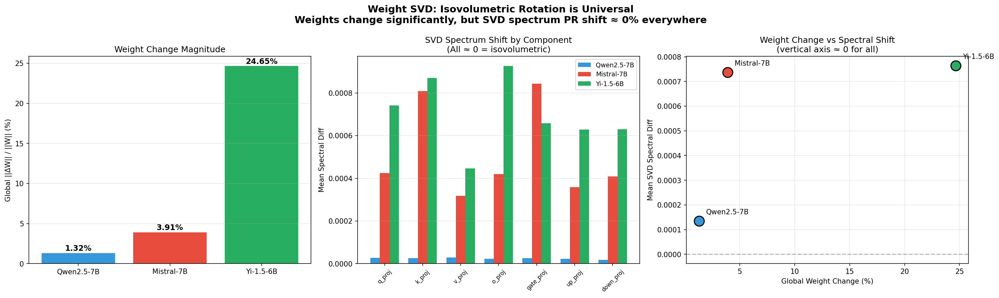

# Spectral Flow Probe v2

> **A 7-band Phased Array Radar for any Transformer.**
> Tells you what your RL training data is actually doing to your model's representation geometry — *before* you waste a billion tokens.


*Three model families. Three companies. Three architectures. One mechanism.*

---

## TL;DR

You ask a model 7 different kinds of questions. You measure the effective dimensionality of its hidden states for each kind. You get a 7-dimensional fingerprint.

That fingerprint tells you:
- Which functional channels in your model are starved for bandwidth
- Which channels are already saturated and don't need more training data
- Whether your RL alignment actually moved the channels you intended
- Whether your training data mix is wasting compute on channels that don't need it

Run this on any HuggingFace model in 2 minutes:

```python
from spectral_flow_probe import SpectralProbe

fp = SpectralProbe("meta-llama/Llama-3.1-8B-Instruct").scan()
print(fp)
```

---

## What the hell is this for?

**You are a model trainer.** You have GPUs. You have data. You have an alignment recipe.
You have no idea whether your data mix matches what your model needs.

**You are a model selector.** Someone published Yet Another 7B Instruct Model.
You have no way to tell whether it's actually balanced or just gamed three benchmarks.

**You are an alignment researcher.** You read 50 papers about RLHF. None of them
told you what RL actually does to the weights. ("It improves preference alignment"
is not an answer.)

This tool gives all three of you the same thing: **a per-channel bandwidth fingerprint** of any Transformer. No more single-number "PR" or "MMLU" or "vibes".

---

## The story (or: why v2 broke v1)

> **Read this if you used v1. Skip if you didn't.**

v1 of this tool measured a scalar PR (Participation Ratio) by feeding random tokens
into the model. It claimed "PR collapse during RLHF" was a real phenomenon and offered
a regularizer to prevent it.

**Both claims were wrong.**

Four nights of experiments destroyed the v1 worldview:

| | Old story | What we actually measured |
|---|---|---|
| **Random-token PR probe** | A reliable thermometer | 30% CV across runs on the *same* checkpoint |
| **"69% PR collapse during DPO"** | Real and dramatic | Measurement noise. Real DPO change: 2.8% |
| **DPO 800 steps damages model** | Yes | No. Total weight drift = 0.02% |
| **RL compresses spectral capacity** | Yes (delta_s drops) | No. Singular values are conserved |

The good news: tearing down the old story revealed a much better one.

**RL alignment is an isovolumetric rotation of the weight singular vectors.**
Σ (singular values, capacity) is conserved. U/V (singular vectors, direction) rotate.
Total bandwidth doesn't change — bandwidth is *re-aimed*.

PR is not a property of a model. **PR = f(model, query)**. Different query types
activate different fractions of the model's capacity. A single PR number is
a single-pixel photo of a 7-megapixel scene.

The new tool is the radar that actually takes the photo.

---

## The seven bands

Each band is a fixed prompt set targeting a specific functional channel:

| Band | Channel | What it measures |
|---|---|---|
| 1. Factual Recall | engram retrieval | Knowledge bandwidth |
| 2. Instruction Following | constraint processing | Format/structural compliance bandwidth |
| 3. Creative Generation | open generation | Open-ended bandwidth |
| 4. Code / Logic | logical reasoning | Symbolic bandwidth |
| 5. Multi-turn Dialogue | context maintenance | Memory bandwidth |
| 6. Counterfactual Reasoning | OOD generalization | Off-distribution bandwidth |
| 7. Safety Boundary | RL specialization | RL-targeted bandwidth |

Prompts are deterministic. Same model + same band = same number, every time.
**CV = 0%.** That's the whole point.

---

## The mechanism (with receipts)



We measured base-vs-instruct weight differences across three model families:

| Family | Origin | Weight change (Frobenius) | SVD spectrum PR shift | Verdict |
|---|---|---|---|---|
| Qwen2.5-7B | Alibaba (China) | **1.32 %** | ≈ 0.00 % | Isovolumetric ✓ |
| Mistral-7B | Mistral AI (France) | **3.91 %** | ≈ 0.02 % | Isovolumetric ✓ |
| Yi-1.5-6B | 01.AI (China) | **24.65 %** | ≈ 0.10 % | Isovolumetric ✓ |

The weight change spans a **20× range**. The SVD shift stays at zero.

This is the smoking gun. Universal across companies, architectures, and alignment
recipes: RL rotates singular vectors, doesn't compress singular values.

---

## The killer feature: data mix audit (照妖镜)

You have a model. You have a training data mix. **Should you spend $50K on this run?**

```python
from spectral_flow_probe import SpectralProbe, BandwidthDiagnostic

# Step 1: Scan your base model
fp = SpectralProbe("your-base-model").scan()

# Step 2: Tell the tool your data mix (use any LLM to classify samples)
data_mix = {
    "band1_factual":         0.05,
    "band2_instruction":     0.30,
    "band3_creative":        0.00,   # ← uh oh
    "band4_code":            0.50,   # ← woah
    "band5_dialogue":        0.05,
    "band6_counterfactual":  0.05,
    "band7_safety":          0.05,
}

# Step 3: Get the verdict
diag = BandwidthDiagnostic()
report = diag.audit_data_mix(fp, data_mix)
print(report)
```

Output:

```
Data Mix Diagnostic: your-base-model

  Band                              PR    Data %  Verdict
  -----------------------------------------------------------------
  Factual Recall                  7.07     5.00%  balanced
  Instruction Following           5.87    30.00%  balanced
  Creative Generation             7.10     0.00%  UNDERSERVED  ⚠️
  Code / Logic                    6.63    50.00%  OVERSUPPLIED 🔻
  Multi-turn Dialogue             5.84     5.00%  UNDERSERVED  ⚠️
  Counterfactual Reasoning        6.90     5.00%  balanced
  Safety Boundary                 6.25     5.00%  UNDERSERVED  ⚠️

  Recommendations:
    • Increase share of Multi-turn Dialogue data — currently 5.0% of mix,
      baseline PR=5.84 suggests this channel needs ~22.7%.
    • Consider reducing Code / Logic data — currently 50.0% of mix,
      3.9× the expected share. Likely wasted capacity.
```

**That's a $50K decision in 3 minutes.**

---

## Five entry points

```python
from spectral_flow_probe import (
    SpectralProbe,        # 7-band radar scan
    RotationAnalyzer,     # weight-space SVD analysis (with single-model mode)
    BandwidthDiagnostic,  # the data mix mirror
    SpectralCallback,     # training-time monitor (fixed-prompt, deterministic)
    spectral_pr_loss,     # differentiable per-band regularizer
)
```

### 1. Scan a model

```python
fp = SpectralProbe("meta-llama/Llama-3.1-8B-Instruct").scan()
print(fp.pr_vector)              # 7-dim numpy array
print(fp.bandwidth_ratio)        # max(PR) / min(PR), lower = more uniform
print(fp.weakest_band.name)      # "Multi-turn Dialogue"
fp.to_json("fingerprint.json")
```

### 2. Compare two models

```python
from spectral_flow_probe import BandwidthComparison

cmp = BandwidthComparison(fp_a=fp_base, fp_b=fp_instruct,
                          label_a="Base", label_b="Instruct")
print(cmp)                       # tabular delta per band
print(cmp.lifted_bands())        # ["Code/Logic", "Creative", ...]
print(cmp.suppressed_bands())
```

### 3. Verify isovolumetric rotation

```python
from spectral_flow_probe import RotationAnalyzer

ra = RotationAnalyzer()
report = ra.compare("base/path", "instruct/path", gpu_id=0)
print(report.is_isovolumetric)    # True for normal RLHF; False if something weird
print(report.verdict())           # plain-English summary
```

### 4. Single-model spectrum profile

(For when you only have the instruct version — common for downstream users.)

```python
profile = ra.profile("only-this-checkpoint", gpu_id=0)
print(profile)                    # per-component, per-layer SVD structure
```

### 5. Training-time monitor

```python
from spectral_flow_probe import SpectralCallback

cb = SpectralCallback(
    every_n_steps=100,
    bands=["band2_instruction", "band7_safety"],   # only what you care about
    logger="wandb",
    drift_threshold=0.10,         # warn if any band's PR shifts > 10%
)
trainer = Trainer(..., callbacks=[cb])
```

---

## Install

```bash
git clone https://github.com/your-org/spectral-flow-probe.git
cd spectral-flow-probe
pip install -e .
```

Requires: `torch`, `transformers`, `safetensors`, `numpy`, `scikit-learn`, `matplotlib`.
Optional for plots: `matplotlib`. Optional for Trainer: `transformers`.

CLI:

```bash
sfp scan meta-llama/Llama-3.1-8B-Instruct --plot radar.png -o fp.json
sfp compare base/path instruct/path --plot compare.png
sfp rotate base/path instruct/path --gpu 0
sfp profile only-this-model --gpu 0
```

---

## What's gone from v1 (and why)

| Removed | Why |
|---|---|
| `SpectralReport.diagnose()` with hardcoded "pr_health" thresholds | PR is not a scalar; thresholds are meaningless |
| `SpectralCallback` random-token probe | 30% measurement CV — useless |
| `BudgetPlanner` empirical reference data | Data was measured with the broken probe |
| `prompts.py` flat 50-prompt list | Replaced with structured 7-band prompts |

If you depended on the v1 API, the migration is small but breaking. v1 is preserved in
git history; just `git checkout v0.1.0`. We don't recommend it.

---

## The empirical record

Every claim in this README is backed by experiments in `experiments/`:

| Experiment | What it shows |
|---|---|
| Exp 7C | Random-token probe: CV=30%. Fixed-prompt probe: CV=0% |
| Exp 7D | PR varies 2× across query types for same model |
| Exp 8 | DPO 800 steps = 0.02% global weight change |
| Exp 9 | 7-Band Radar across 3 families |
| Exp 9B | Isovolumetric rotation universal: weight change spans 1.3% to 24.6%, SVD spectrum PR shift stays at 0% |

Calibration evidence:


Bandwidth reallocation evidence:


Weak DPO control (no detectable change with insufficient training):


---

## Theory references

The full theoretical derivation, including the connection to information-theoretic
channel capacity and the proof of why isovolumetric rotation explains both
alignment efficacy and benchmark insensitivity, is in the companion paper:

**"Representation Bandwidth Economics: RL Alignment as Isovolumetric Rotation of the Spectral Beam Pattern"** (in prep).

For the experimental log including failed hypotheses and the path that led here, see
`spectral_flow_exp/updates/EXPERIMENT_LOG.md`.

---

## License

MIT. Use it. Fork it. Tell us what you find.

---

## Acknowledgments

This tool exists because v1 was wrong and we noticed.
We expect v2 to be wrong in some way too. Tell us how.
